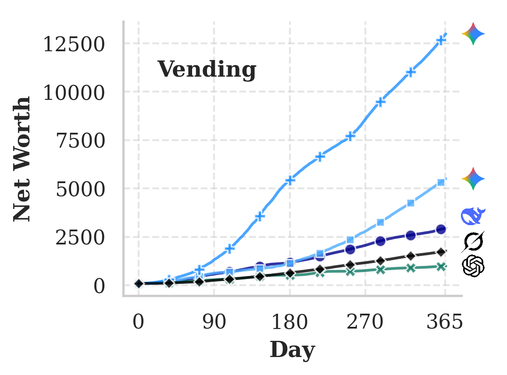
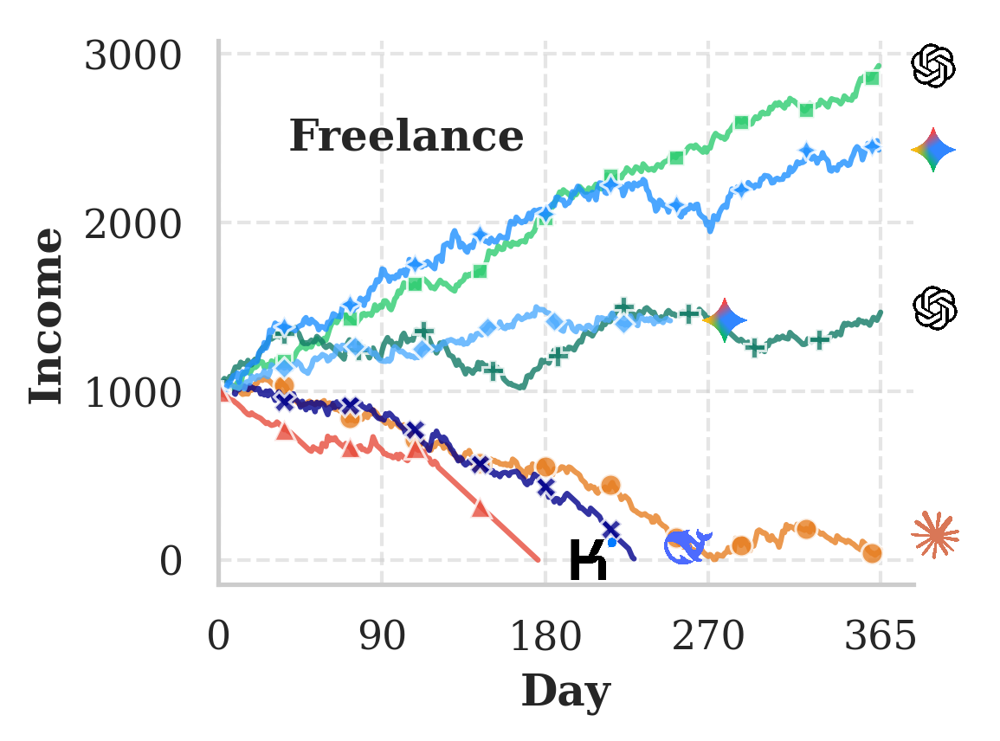
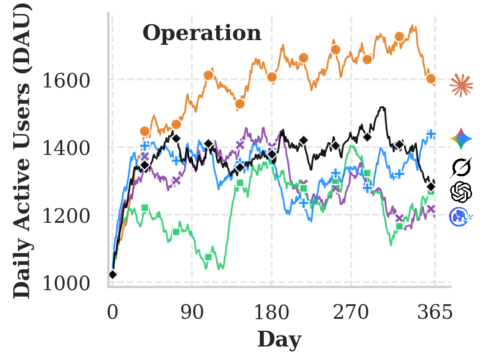
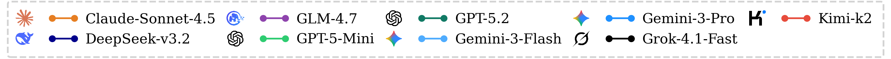

<h1 align="center">
<br>
EcoGym: Evaluating LLMs for Long-Horizon Plan-and-Execute in Interactive Economies
</h1>

<p align="center">
  <a href="https://arxiv.org/abs/2602.09514"></a>
  <a href="#"></a>
  <a href="#"></a>
</p>

<p align="center">
  <strong>A Generalizable Benchmark for Continuous Plan-and-Execute Decision Making in Interactive Economies</strong>
</p>

## 🌟 Overview

Long-horizon planning is widely recognized as a core capability of autonomous LLM-based agents; however, current evaluation frameworks suffer from being largely episodic, domain-specific, or insufficiently grounded in persistent economic dynamics. We introduce **EcoGym**, a generalizable benchmark for continuous plan-and-execute decision making in interactive economies. 

EcoGym comprises three diverse environments: **Vending**, **Freelance**, and **Operation**, implemented in a unified decision-making process with standardized interfaces, and budgeted actions over an effectively unbounded horizon (1000+ steps if 365 day-loops for evaluation). The evaluation is based on business-relevant outcomes (e.g., net worth, income, and DAU), targeting long-term strategic coherence and robustness under partial observability and stochasticity. 

<div align="center">
  
  <p><i>EcoGym's design principles and three economic environments: Vending, Freelance, and Operation.</i></p>
</div>

Experiments across eleven leading LLMs expose a systematic tension: no single model dominates across all three scenarios. Critically, we find that models exhibit significant suboptimality in either high-level strategies or efficient action executions. EcoGym is released as an open, extensible testbed for transparent long-horizon agent evaluation and for studying controllability–utility trade-offs in realistic economic settings.

## 📊 Experimental Results

Our empirical evaluation on EcoGym reveals a significant performance gap in current LLMs: no single model consistently achieves superior performance across all scenarios, highlighting the inherent difficulty of long-horizon economic decision-making. Critically, we find that models exhibit significant suboptimality in either high-level strategies or efficient actions executions. Furthermore, we conduct a comprehensive suite of 8 diagnostic experiments or case studies, encompassing factors such as context window length, agent behavior patterns, additional memory modules, and human baselines.

<div align="center">
  <table>
    <tr>
      <td align="center"></td>
      <td align="center"></td>
      <td align="center"></td>
    </tr>
  </table>
  
  <p><i>Performance comparison across eleven leading LLMs in the three EcoGym environments.</i></p>
</div>

## 📦 Code Availability

**Note**: The source code for EcoGym is currently under internal compliance review and approval process. We are working to make the code publicly available as soon as the review is completed. Thank you for your patience and understanding.

For updates on code release, please check back later or watch this repository for notifications.

## 📝 Citation

If you find this work useful, please cite:

```bibtex
@misc{hu2026ecogymevaluatingllmslonghorizon,
      title={EcoGym: Evaluating LLMs for Long-Horizon Plan-and-Execute in Interactive Economies}, 
      author={Xavier Hu and Jinxiang Xia and Shengze Xu and Kangqi Song and Yishuo Yuan and Guibin Zhang and Jincheng Ren and Boyu Feng and Li Lu and Tieyong Zeng and Jiaheng Liu and Minghao Liu and Yuchen Elenor Jiang and Wei Wang and He Zhu and Wangchunshu Zhou},
      year={2026},
      eprint={2602.09514},
      archivePrefix={arXiv},
      primaryClass={cs.CL},
      url={https://arxiv.org/abs/2602.09514}, 
}
```

## 🙏 Acknowledgements

This project is adapted from [Agno](https://github.com/agno-agi/agno), a framework for building multi-agent systems that learn and improve with every interaction.
